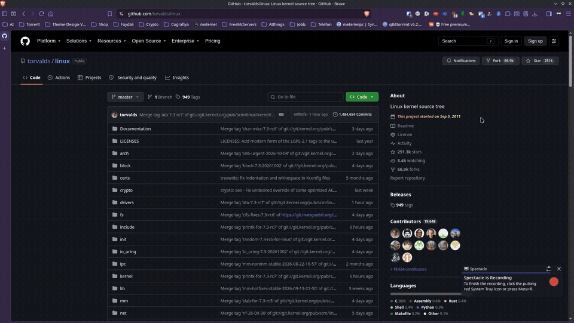

<p align="center">
  
</p>

<h1 align="center">GitHub Project Start Date</h1>

<p align="center">
  <b>A lightweight, privacy-focused browser extension that displays the exact creation date of any GitHub repository.</b>
</p>

<p align="center">
  <a href="https://github.com/MustafaEsatTemel/Github-Project-Start-Date/releases"></a>
  
  
  
</p>

---

## 🎬 Demo / Nasıl Çalışır?

<p align="center">
  
</p>

> 📹 *Higher quality WebM video is also available in the repository: [`Animation.webm`](Animation.webm)*

---

## 📖 Overview / Genel Bakış

Have you ever browsed an open-source project and wondered: *"When was this repository first created?"*

**GitHub Project Start Date** answers that question instantly. It injects the initial repository start date directly into the GitHub sidebar (right under the **About** section) with a sleek animated gradient. You can also view it anytime by clicking the extension icon in your toolbar.

Açık kaynak bir projeyi incelerken *"Bu proje tam olarak ne zaman başladı?"* diye merak ettiyseniz, bu eklenti reponun ilk oluşturulma tarihini doğrudan sayfanın sağındaki **About** bölümüne animasyonlu şekilde ekler!

---

## ✨ Features / Özellikler

- 📌 **Direct In-Page Integration:** Appears right under the *About* section on any GitHub repository page.
- 🛡️ **Private Repositories Supported:** Works on your private repositories without requiring authentication or personal access tokens.
- ⚡ **Zero API Rate Limits:** Reads page metadata locally, completely bypassing GitHub's 60 req/hour API rate limit.
- 🔄 **Turbo / SPA Navigation:** Automatically adapts to GitHub's Turbo Drive page transitions without needing page reloads.
- 🪟 **Toolbar Popup:** Click the extension icon to view repository start date in a modern dark-mode card.
- 🚀 **Manifest V3:** Built with the latest, modern WebExtension Manifest V3 standard for speed, security, and low memory usage.
- 🖤 **Official Classic GitHub Branding:** Clean, crisp official icons from 16x16 to 128x128.

---

## 🛠️ Manuel Kurulum Rehberi (Adım Adım / Step-by-Step)

Mağazayı beklemeden eklentiyi hemen tarayıcına yükleyip kullanabilirsin:

### 🌐 Chrome / Brave / Edge / Opera İçin Kurulum:

1. Bu repodaki yeşil **Code -> Download ZIP** butonuna bas veya [Releases](https://github.com/MustafaEsatTemel/Github-Project-Start-Date/releases) sayfasından `Github-Project-Start-Date-Chrome.zip` dosyasını indir.
2. İndirdiğin zip dosyasını bir klasöre çıkart (içinde `Github-Project-Start-Date-Chrome` klasörünü göreceksin).
3. Tarayıcının uzantılar sayfasını aç:
   * **Chrome:** `chrome://extensions`
   * **Brave:** `brave://extensions`
   * **Edge:** `edge://extensions`
4. Sayfanın sağ üst köşesindeki **"Geliştirici Modu" (Developer Mode)** anahtarını aç.
5. Sol üstte beliren **"Paketlenmemiş öğe yükle" (Load unpacked)** butonuna tıkla.
6. Klasör seçici penceresinden **`Github-Project-Start-Date-Chrome`** klasörünü seç ve onayla.
7. 🎉 **Hazır!** Herhangi bir GitHub reposuna girdiğinde sağdaki About bölümünde başlangıç tarihini göreceksin.

---

### 🦊 Firefox İçin Kurulum:

1. [Releases](https://github.com/MustafaEsatTemel/Github-Project-Start-Date/releases) sayfasından `Github-Project-Start-Date-Firefox.zip` dosyasını indir veya repoyu klonla.
2. Firefox'ta adres çubuğuna şunu yazıp Enter'a bas:
   ```text
   about:debugging#/runtime/this-firefox
   ```
3. **"Geçici Eklenti Yükle..." (Load Temporary Add-on...)** butonuna tıkla.
4. `Github-Project-Start-Date-main-Firefox` klasörünün içindeki **`manifest.json`** dosyasını seç.
5. 🎉 Eklenti hemen aktif hale gelir!

---

## 🔒 Privacy & Permissions / Gizlilik İlkeleri

- **No Tracking:** Zero analytics scripts, tracking beacons, or third-party connections.
- **Minimal Permissions:** Only accesses `github.com` and `api.github.com` strictly to read creation dates.
- **Local Execution:** 100% of the logic runs locally inside your browser.

---

## 📂 Project Structure / Proje Yapısı

```text
├── Github-Project-Start-Date-Chrome/         # Chrome / Brave / Edge Manifest V3 eklentisi
│   ├── manifest.json
│   ├── content.js
│   ├── popup.html / popup.js / style.css
│   └── Images/                               # 16, 32, 48, 128px orijinal ikonlar
├── Github-Project-Start-Date-main-Firefox/   # Firefox Manifest V3 eklentisi
├── Store-Assets/                             # Mağaza vitrin görselleri (1280x800 & 440x280)
├── Animation.webm                            # Yüksek kaliteli orijinal eğitim videosu
├── demo.gif                                  # README için optimize edilmiş hafif canlı demo (1.8MB)
├── Github-Project-Start-Date-Chrome.zip      # Yayına hazır Chrome paketi
├── Github-Project-Start-Date-Firefox.zip     # Yayına hazır Firefox paketi
└── README.md
```

---

## 👨‍💻 Author / Geliştirici

Created with ❤️ by **[Mustafa Esat Temel](https://github.com/MustafaEsatTemel)**

---

## 📄 License

This project is open-source and licensed under the [MIT License](LICENSE).
